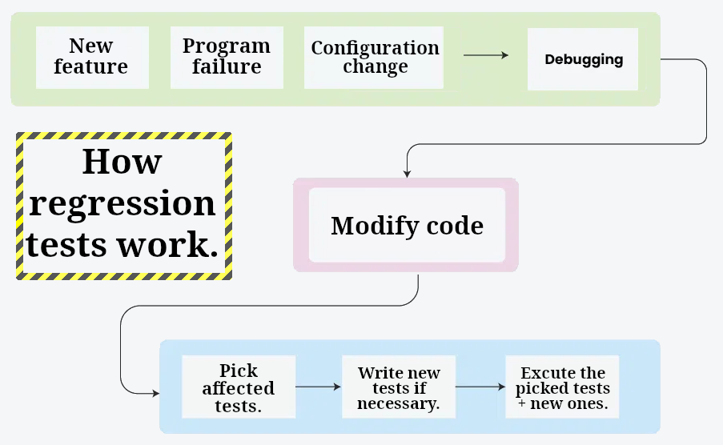
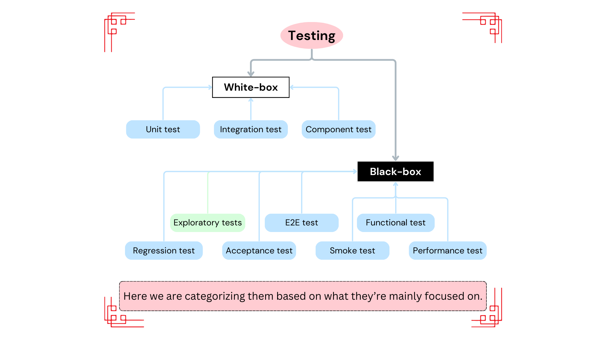

# What is testing all about?

- The goal of testing:
  - To test that users can actually use an app.
  - To test that an app doesn't break when:
    - Bad data are entered.
    - Unexpected actions are performed.
- Anticipate what would happen when a user:
  - Makes a typo.
  - Tries to save an incomplete form.
  - Uses the wrong API.
- Check if someone can easily compromise data or gain access to a resource they're not supposed to.
- **A good testing suite should try to break your app and help understand its limit**.

# Tests -- categorized according to their execution type

- Automated tests: performed by a machine that executes a test script that was written in advance.
- Manual tests.

<table>
  <caption>
    A quick run down for the ones I felt are more common.
  </caption>
  <thead>
    <tr>
      <th></th>
      <th>Unit testing</th>
      <th>Integration testing</th>
      <th>E2E testing</th>
      <th>Smoke testing</th>
    </tr>
  </thead>
  <tbody>
    <tr>
      <td>Cost</td>
      <td>Cheap</td>
      <td>Expensive</td>
      <td>Expensive</td>
      <td>Moderate</td>
    </tr>
    <tr>
      <td>Complexity (setup & maintain)</td>
      <td>Easy</td>
      <td>Hard</td>
      <td>Harder</td>
      <td>Moderate</td>
    </tr>
    <tr>
      <td>Objective</td>
      <td>Individual methods/functions work well</td>
      <td>Different modules/services work well together</td>
      <td>Verifies that various user flows work as expected</td>
      <td>
        The major features of the system are working as expected.
      </td>
    </tr>
  </tbody>
</table>

## Automated tests

- Unit testing.
  

    

      Breaking down unit tests.
    

    <ul>
      <li>Cheap.</li>
      <li>Very low level.</li>
      <li>Testing individual methods/functions.</li>
      <li>A unit is the smallest testable component of an application.</li>
    </ul>
  

- Integration Tests.
  

    

      Breaking down integration tests.
    

    <ul>
      <li>Expensive.</li>
      <li>Different modules/services used by the app work well together.</li>
    </ul>
  

- Functional tests.
  

    

      Breaking down functional tests.
    

    <ul>
      <li>Black-box testing</li>
      <li>Focuses on the business requirements.</li>
      <li>Checks output of an action, <b>not</b> the intermediate states.</li>
    </ul>
  

- E2E Testing.
  

    

      Breaking down E2E tests.
    

    <ul>
      <li>Expensive.</li>
      <li>Hard to maintain.</li>
      <li>Replicates a user behavior.</li>
      <li>Various user flows work as expected.</li>
      <li>A few key E2E tests. Rely more on lower level types of testing (unit and integration tests).</li>
    </ul>
  

- Acceptance Testing.
  

    

      Breaking down acceptance tests.
    

    <ul>
      <li>Replicates a user behavior.</li>
      <li>Measure the performance of the system.</li>
      <li>Rejects changes if certain goals are not met.</li>
      <li>Verify if a system satisfies business requirements.</li>
    </ul>
  

- Performance testing.
  

    

      Breaking down performance tests.
    

    <ul>
      <li>Evaluates how a system performs under a particular workload.</li>
      <li>Measures the reliability, speed, scalability, and responsiveness.</li>
    </ul>
  

- Smoke Tests.
  

    

      Breaking down smoke tests.
    

    <ul>
      <li>Basic tests.</li>
      <li>Quick to execute</li>
      <li>Checks the basic functionality of the app.</li>
      <li>Guarantee that the major features of the system are working as expected.</li>
      <li>
        Useful right after:
        <ul>
          <li>
            A new build is made & we wanna decide whether or not you can run more expensive tests.
          </li>
          <li>
            A deployment to make sure that the application is running properly in the newly deployed environment.
          </li>
        </ul>
      </li>
    </ul>
  

- Component Testing.
  

    

      Breaking down component tests.
    

    <ul>
      <li>
        Breaking applications into smaller logical units called components.
      </li>
      <li>
        Range from fairly small (like a button) to more complex (like a registration form).
      </li>
      <li>
        Tend to be easily testable.
      </li>
      <li>
        Written by the developers working on the component.
      </li>
      <li>
        <b>
          Component tests do nothing to ensure that all the layers of your app are working well together.
        </b>
      </li>
      <li>
        Common scenarios for component tests:
        <ul>
          <li>Testing a date picker works properly.</li>
          <li>A form shows/hides specific sections based on input.</li>
        </ul>
      </li>
      <li>
        For this you can use
        <a href="https://storybook.js.org/">Storybook</a>
        or <a href="https://www.cypress.io/">Cypress</a>.
      </li>
    </ul>
  

- Regression Tests.
  

    

      Breaking down regression tests.
    

    <ul>
      <li>
        <em>Re-running</em> functional and non-functional tests to ensure that previously developed and tested software still performs as expected after a change.
      </li>
      <li>If not, that would be called a regression.</li>
      <li>A software regression is a type of software bug where a feature that has worked before stops working.</li>
      <li>
        Things like:
        <ul>
          <li>Bug fixes.</li>
          <li>Software enhancements.</li>
          <li>Configuration changes</li>
        </ul>
      </li>
      <li>
        Some tools used for regression tests:
        <ul>
          <li><a href="https://www.selenium.dev/">Selenium</a>.</li>
          <li><a href="https://www.ranorex.com/blog/regression-testing/">Ranorex Studio</a>.</li>
        </ul>
      </li>
    </ul>
    
  

> [!TIP]
>
> Functional VS integration.
>
> - An integration test may simply verify that you can query the database.
> - While a functional test would expect to get **a specific value** from the database as defined by the product requirements.

## Manual tests

- Exploratory testing:
  - Objective: uncover non-obvious errors.
  - An exploratory testing session should not exceed two hours.
  - With a clear scope -- helping testers to focus on a specific area of the software.

# Tests -- categorized according to their scope

- Black-box:
  - The tester is not concerned with the implementation details.
  - Focused on validating the functionality based on the provided specifications/requirements.
    - What's input and output.
- White-box:
  - Focuses on code coverage:
    - Path coverage: `3 / 0` throws an error for a division operation.
    - Statement coverage: `3 + 3` equals `6` for an additional operation.
  - Analyze the
    - Internal structures the used data structures.
    - Internal design.
    - Code structure.
  - AKA:
    - Open box testing.
    - Glass box testing.
    - Clear box testing.
    - Structural testing.
    - Transparent testing.

<table>
  <caption>
    Most important aspects of the two, put together side by side.
  </caption>
  <thead>
    <tr>
      <th></th>
      <th>Black Box Testing</th>
      <th>White Box Testing</th>
    </tr>
  </thead>
  <tbody>
    <tr>
      <td>Objective</td>
      <td>Testing the functionality of the software.</td>
      <td>Ensuring the internal code is correct and efficient.</td>
    </tr>
    <tr>
      <td>Scope</td>
      <td>Overall behavior.</td>
      <td>Internal logic.</td>
    </tr>
    <tr>
      <td>Performed by</td>
      <td>QA</td>
      <td>Developer</td>
    </tr>
    <tr>
      <td>Development methodology</td>
      <td>BDD <small>(Behavior-Driven Development)</small></td>
      <td>TDD <small>(Test-Driven Development)</small></td>
    </tr>
    <tr>
      <td>Granularity</td>
      <td>Just test CBP and the positive scenarios.</td>
      <td>Go for code coverage -- Do not go overboard, sometimes it does not worth having 100% code coverage.</td>
    </tr>
  </tbody>
</table>

## E2E Testing

- A technique.

| Pros                                                                                                                         | Cons                                         |
| ---------------------------------------------------------------------------------------------------------------------------- | -------------------------------------------- |
| Ensures the app is functioning as a cohesive whole.                                                                          | More difficult to set up, run, and maintain  |
| Tests are written in code with an API that **simulates the steps** that a real user would take.                              | Provision testing infrastructure in CI       |
| Can be written by developers/QA Teams.                                                                                       | Testing certain scenarios require more setup |
| Tests the app from the web browser through to the backend, as well as testing integrations with 3rd-party APIs and services. |                                              |

### Scenarios for E2E

- Validating **critical business path (CBP)**, things such as authentication and purchasing.
- Ensuring data is persisted and displayed through multiple screens.
  - This means verifying that the saved data appears correctly across different parts of the application. For example, if a user enters information on one page, that same information should be accurately displayed when the user navigates to another related page.
- Running Smoke Tests and System Checks before deployment.

# Refs

[The different types of software testing](https://www.atlassian.com/continuous-delivery/software-testing/types-of-software-testing)

# Also published:

- At [dev.to](https://dev.to/kasir-barati/whats-testing-in-software-development-5b61)

# Learn more

- [Understanding test strategy in software testing](https://youtu.be/BHq8ut1PzF4?si=ugGIHhpDEuUSOMJK).
