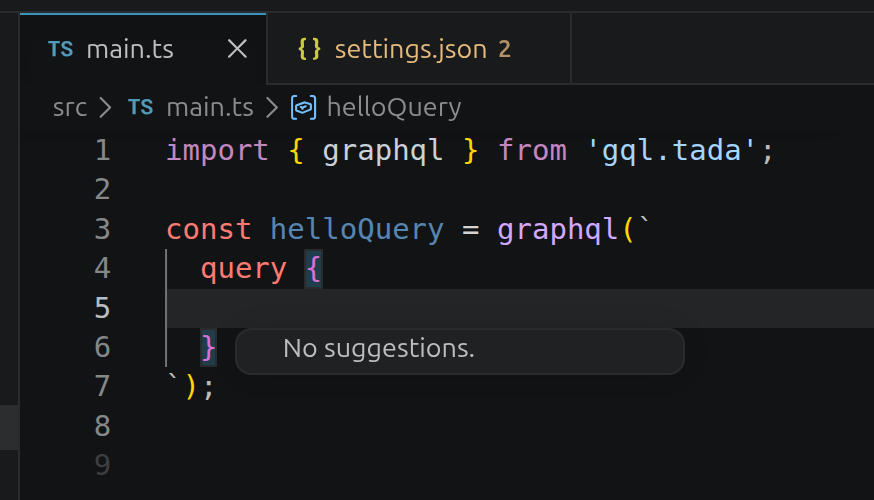
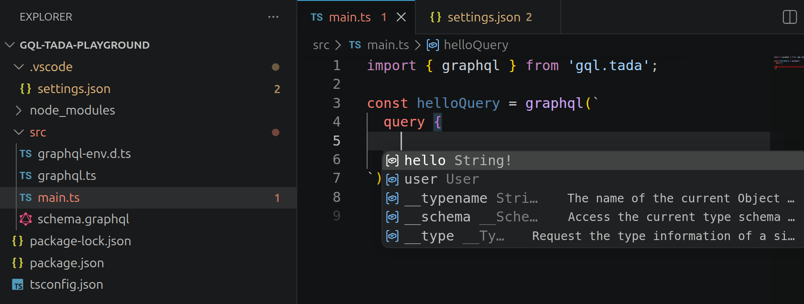

# gql.tada

> [!TIP]
>
> If you do not see any intellisense:
>
> 
>
> Then you need to select the correct version as explain here: https://dev.to/kasir-barati/gqltada-strongly-typed-neat-intellisense-2bhm
>
> Now you should be able to see the intellisense:
>
> 