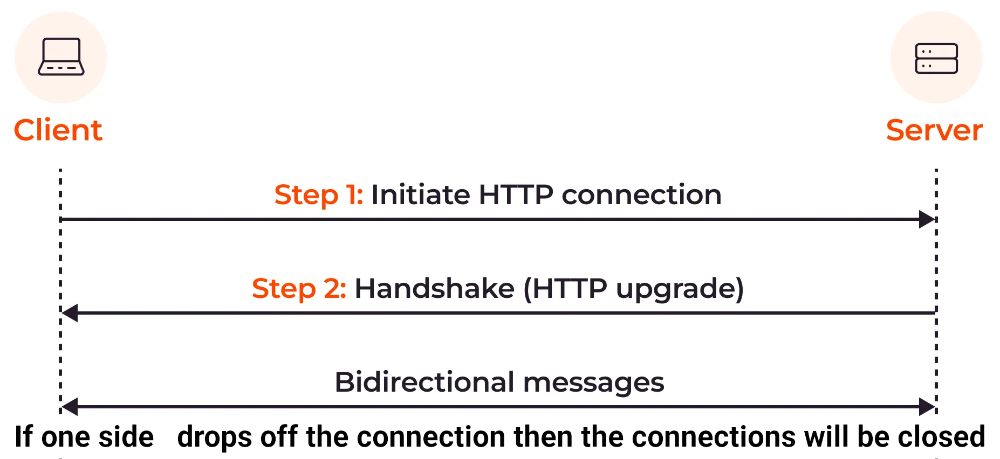

# WebSockets

- Realtime communication.
- Bidirectional communication mean.
  - This type of connection is often referred to as full-duplex connection.
- Provide communication channel over a single [Transmission Control Protocol (TCP)](https://github.com/kasir-barati/html-css/tree/main/05-the-browser-and-the-dom#tcpip-model) connection.

## Potential techniques that might be sufficient to implement instead of WebSocket

In the majority of cases, your client should not use WebSockets to stay up to date with your backend, **instead** you can use:

- **Short polling**: Poll [intermittently](https://dictionary.cambridge.org/dictionary/english/intermittently) with queries.
- **Re-execute queries on demand**: when a user performs a relevant action (e.g. clicking on a refresh button) refetch data.

## Scenarios where we need WebSockets

- **Large objects, small, incremental changes**:
  - Short polling a large object is expensive, especially here since most of the object's fields have not changed.
  - Instead:
    1. Fetch the object's initial state with a query.
    2. Server proactively push updates to individual fields as they occur.
- **Low-latency, real-time updates**:
  - Clients in a chat app want to receive new messages ASAP.

## How it works theoretically:



1. Client asks server to form a WebSocket connection.

   ```http
   GET ws://example.com HTTP/1.1
   Connection: Upgrade
   Upgrade: websocket
   ```

2. Server says let's do it (handshake completed successfully and server responses):

   ```http
   HTTP/1.1 101 Switching Protocols
   Upgrade: websocket
   Connection: Upgrade
   ```

Done, now:

- From this point onward we have an open TCP/IP connection open.
- Each party can send message to the other party instantly.
- The connection closes when one party drops off.

## How it is done in practice

1. We need a backend: `apps/websocket-backend`:
2. We need a client: `apps/websocket-client`.

> [!IMPORTANT]
>
> `ws` library is good and all but you need to reinvent the wheel many times. Like broadcasting a message and things like that.
>
> `ws` is a low-level library. But for a real world app most of the times we need something a bit more mature.

### [`socket.io`](https://socket.io/)

- Alternatives to socket.io:
  - [GraphQL subscriptions](https://github.com/kasir-barati/graphql/blob/main/docs/subscription.md).
  - [Pusher](https://pusher.com/).
- Might like to learn about some of [the challenges of building a realtime app](https://www.infoq.com/articles/challenges-realtime-chat-service-pusher/).
