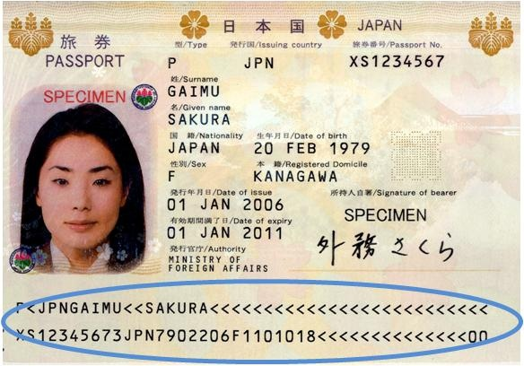

# Intro

I found also these two regex in [here](https://community.zscaler.com/t/international-passport-numbers-regex/12433). But IDK whether which one were correct. Therefore I just select one of them and put it in the `passport.ts`. Please read [this document](http://www.highprogrammer.com/alan/numbers/mrp.html) for more info about the passport numbers and why passports look like this:

# Generic regex

Beware of using `genericRegexForPassportNumber` regex. Why? because it passes most wrong passport numbers. But if you are in a bad force you can use it for a short period of time but you need to fix this issue later on.

# Germany

1. `[A-Za-z][A-Za-z0-9]{9}D[^A-Za-z0-9]`
2. `\d[A-Za-z0-9]{9}D[^A-Za-z0-9]`
3. `/^[CFGHJKLMNPRTVWXYZ0-9]{9}$/`

If you had any Idea open an issue.

# Switzerland

The same thing happened for Swiss, But I am not sure which one is better. If you are from Swiss do not hesitate if I am wrong, please create an issue if you can fix this regex.

1. `[A-Za-z]\d{7}\D`
2. `/^[A-Z]\d{7}$/`

# Canada

Same story for Canada

1. `/^[A-Z]{2}\d{6}$/`
2. `[A-Za-z]{2}\d{6,7}\D`

# Greece

Same story for Greece

1. `/^[A-Z]{2}\d{7}$/`
2. `[A-Za-z]{2}\d{7}\D`

# Philippines

# Singapore

# Austria

1. `[A-Za-z][A-Za-z0-9]{7}[^A-Za-z0-9]`
2. `/^[A-Z]\d{7}$/`

# Portugal

1. `/^[A-Z]\d{6}$/`
2. `[A-Za-z][a-za-z0-9]{6}[^a-za-z0-9]`
3. `\d[A-Za-z0-9]{6}[^a-za-z0-9]`

# Belgium

1. `/^[A-Z]{2}\d{6}$/`
2. `[A-Za-z][A-Za-z0-9]{7}[^A-Za-z0-9]`
3. `\d[A-Za-z0-9]{7}[^a-za-z0-9]`

# Australia

1. `[A-Za-z][A-Za-z0-9]{7}[^A-Za-z0-9]`
2. `\d[A-Za-z0-9]{7}[^A-Za-z0-9]`
3. `/^[A-Z]\d{7}$/`

# Ukraine

IDK what's going on in Ukraine and how they manage traveling in their country. It is new to me.

1. `[A-Za-z][A-Za-z0-9]{7}[^A-Za-z0-9]`
2. `\d[A-Za-z0-9]{7}[^A-Za-z0-9]`
3. `/^[A-Z]{2}\d{6}$/`

## Ukraine (Domestic) Passport

1. `/^[A-Z]{2}\d{6}$/`
2. `/\d{9}\D/`

# Ireland

1. `[A-Za-z][a-za-z0-9]{6}[^a-za-z0-9]`
2. `\d[A-Za-z0-9]{6}[^a-za-z0-9]`
3. `[A-Za-z][A-Za-z0-9]{8}[^A-Za-z0-9]`
4. `\d[A-Za-z0-9]{8}[^A-Za-z0-9]`
5. `/^[A-Z0-9]{2}\d{7}$/`

# Spain

1. `[A-Za-z][a-za-z0-9]{7,8}[^a-za-z0-9]`
2. `\d[A-Za-z0-9]{7,8}[^a-za-z0-9]`
3. `/^[A-Z0-9]{2}([A-Z0-9]?)\d{6}$/`

# Netherlands

1. `[A-Za-z][a-za-z0-9]{8}[^a-za-z0-9]`
2. `\d[A-Za-z0-9]{8}[^a-za-z0-9]`
3. `/^[A-Z]{2}[A-Z0-9]{6}\d$/`

# Finland

1. `[A-Za-z][a-za-z0-9]{8}[^a-za-z0-9]`
2. `/^[A-Z]{2}\d{7}$/`
3. `\d[A-Za-z0-9]{8}[^a-za-z0-9]`

# Italy

1. `/^[A-Z0-9]{2}\d{7}$/`
2. `[A-Za-z][a-za-z0-9]{8}[^a-za-z0-9]`
3. `\d[A-Za-z0-9]{8}[^a-za-z0-9]`

# China

[G=Ordinary, E=Electronic] followed by 8-digits, or E followed by any UPPERCASE letter (except I and O) followed by 7 digits

1. `/[A-Za-z][a-za-z0-9]{8,9}[^a-za-z0-9]/`
2. `/^G\d{8}$|^E(?![IO])[A-Z0-9]\d{7}$/`
3. `/\d[A-Za-z0-9]{8,9}[^a-za-z0-9]/`

# Japan

1. `/[A-Za-z][a-za-z0-9]{8,10}[^a-za-z0-9]/`
2. `/^[A-Z]{2}\d{7}$/`
3. `/\d[A-Za-z0-9]{8,10}[^a-za-z0-9]/`

# Poland

1. `/[A-Z]{2}[0-9]{7}\D/`
2. `/^[A-Z]{2}\d{7}$/`

# Brazil

1. `/[A-Z]{2}[0-9]{6}\D/`
2. `/^[A-Z]{2}\d{6}$/`

# New Zealand

# Korea

IDK which one is South Korea, and which one is for North Korea. I hope one day they become one united country again, It will decrease our developer's life concerns too :smile:.

1. `/^[MS]\d{8}$/`
2. `/[A-Za-z]{2}[0-9]{7}\D/`
3. `/\d[A-Za-z]\d{7}\D/`
4. `/[A-Za-z]\d{8}\D/`
5. `/\d{9}\D/`

# Luxembourg

1. `/I[A-Za-z0-9]{5}\d\D/`
2. `/^[A-Z0-9]{8}$/`

# Malaysia

1. `/[AHKE]\d{8}\D/`
2. `/^[AHK]\d{8}$/`

# France

1. `/^\d{2}[A-Z]{2}\d{5}$/`
2. `/\d{2}[A-Za-z0-9]{2}\d{5}\D/`

# Czech Republic

1. `/^\d{8}$/`
2. `/\d{8}\D/`

# Sweden

1. `/\d{8}\D/`
2. `/^\d{8}$/`

# Russia (International and Domestic)

1. `/^\d{9}$/`
2. `/\d{10}\D/`

# Mexico

# United Kingdom

1. `/\d{9}\D/`
2. `/^\d{9}$/`

# Bulgaria

1. `/\d{9}\D/`
2. `/^\d{9}$/`

# Romania

1. `/\d{9}\D/`
2. `/^\d{8,9}$/`

# Denmark

1. `/\d{9}\D/`
2. `/^\d{9}$`

# Taiwan
